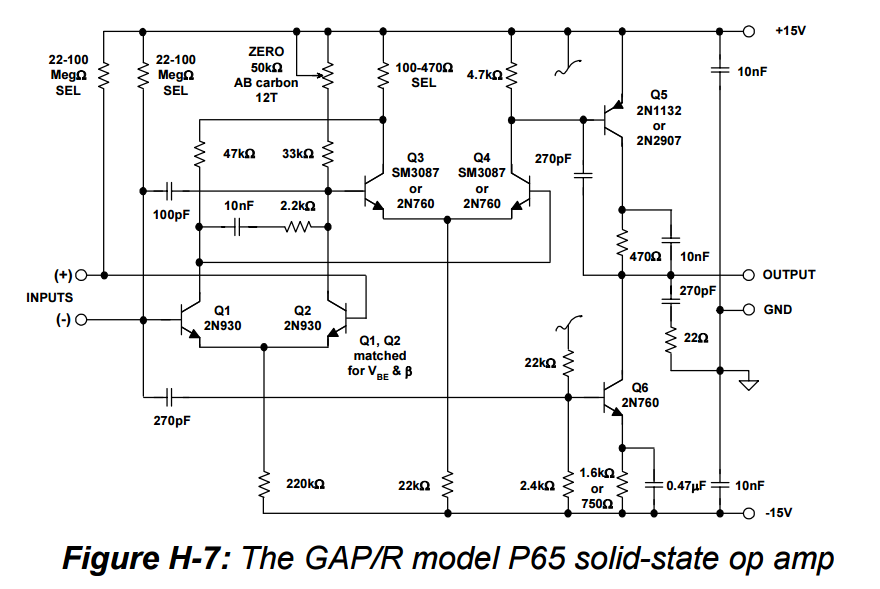

# Electronics
A central place to organize and publish all of my hobbyist electronics knowledge and projects.

## Wiki

My first attempt at curating this clump of electronics knowledge was this [wiki](https://github.com/pepaslabs/Electronics/wiki).

## EEVBlog threads of interest

- [UT61E drift and recalibration](https://www.eevblog.com/forum/testgear/ut61e-drift-and-recalibration/)
  - [This post](https://www.eevblog.com/forum/testgear/ut61e-drift-and-recalibration/msg345532/#msg345532) describes replacing the built-in vref (75ppm/C) with the LT1790 (5ppm/C).

### Building a resistance reference box

- [Resistance standard shielding - how important is it?](http://www.eevblog.com/forum/metrology/resistance-standard-shielding-how-important-is-it/)
- [Precision Resistor Box Project](http://www.eevblog.com/forum/metrology/precision-resistor-box-project/)

### Communication checksums

- [How should be a serial communication packet format ?](http://www.eevblog.com/forum/microcontrollers/how-should-be-a-serial-communication-packet-format/msg1256957/#msg1256957)
  - This thread links to this excellent [overview of CRC's](https://users.ece.cmu.edu/~koopman/pubs/KoopmanCRCWebinar9May2012.pdf).

[Fletcher16](https://en.wikipedia.org/wiki/Fletcher%27s_checksum) seems to be a good choice.  It is easy to understand and implement, performant, and has "good enough" data integrity for simple use-cases (i.e. sending small data packets between an Arduino and a PC).

- [C implementation](https://en.wikipedia.org/wiki/Fletcher%27s_checksum#Implementation)
- [Python implementation](https://gist.github.com/globby/9337839)

### Learning how op-amps work

- In [Doing opamp educational stuff - suggestions wanted](http://www.eevblog.com/forum/projects/doing-opamp-educational-stuff-suggestions-wanted/msg1270993/#msg1270993), Ian.M suggests looking at the schematic of a very early op-amp, the GAP/R P65, which only uses 6 transistors.  See [[1]](http://www.analog.com/media/en/training-seminars/design-handbooks/Op-Amp-Applications/SectionH.pdf) and [[2]](http://www.philbrickarchive.org/pp65a.htm).

## Fluid baths for electronics (for volt-nuts, resistance-nuts, etc)

Immersing electronics in oil is a tempting idea to stablize the temperature of the components, which helps combat the temperature coefficient of the components in a precision circuit (i.e. a voltage or resistance transfer standard).

But what fluid should you use?

### Mineral oil

This seems to be the first idea people come across -- minearl oil is non-conductive, so you can immerse electronics in it.  Searching YouTube for "[raspberry pi minearl oil](https://www.youtube.com/results?search_query=raspberry+pi+minearl+oil)" shows lots of cool project ideas.

However, it turns out that over time, minearl oil breaks down and becomes acidic [[1]](http://www.eevblog.com/forum/metrology/ultra-precision-reference-ltz1000/msg410930/#msg410930) [[2]](https://www.eevblog.com/forum/projects/suggestions-for-a-temperature-sensor/msg75547/#msg75547).  It could be used, but for best results you may need to monitor the pH and change the oil when (or before!) it becomes acidic.

### Silicone oil

It appears silicone oil does not suffer from the same problems as mineral oil, and it appears this is the oil used in the Vishay hermetically sealed resistors [[1]](http://www.eevblog.com/forum/metrology/ultra-precision-reference-ltz1000/msg410930/#msg410930).

If you search amazon.com for "[silicone oil high purity](https://www.amazon.com/s/ref=nb_sb_noss?url=search-alias%3Daps&field-keywords=silicone+oil+high+purity&rh=i%3Aaps%2Ck%3Asilicone+oil+high+purity)", you'll find 16oz bottles from CCS (Consolidated Chemical & Solvents LLC) from $18 to $25.  These are available in viscosities from 0.65cSt to 100,000cSt.  Here's a helpful [video](https://www.youtube.com/watch?v=g1c4E1ze0Vo) comparing the viscosities of silicone oil.

## Hermetic seals

- [Hermetic vs “Near Hermetic” Packaging A Technical Review](https://www.tjgreenllc.com/2016/09/21/hermetic-vs-near-hermetic-packaging-a-technical-review/)
  - _"Moisture permeability in most glasses, metals and ceramics is negligible. But not so with any plastic, it is several orders of magnitude greater..."_
  - _"Polymeric materials such as silicones and epoxies do not provide a hermetic seal..."_

## Ageing voltage references

- zlmex [linked](http://www.eevblog.com/forum/metrology/t-c-hysteresis-measurements-on-brand-new-lt1027dcls8-5-voltage-reference/msg981794/#msg981794) to an article by V. S. Orlov about how Datron ages their reference zener diodes.

## Threads I need to mine for volt-nutting tips:

- [T.C. + Hysteresis measurements on brand new LT1027DCLS8-5 voltage reference](http://www.eevblog.com/forum/metrology/t-c-hysteresis-measurements-on-brand-new-lt1027dcls8-5-voltage-reference/)
- [DIY Low EMF cable and connectors](http://www.eevblog.com/forum/metrology/diy-low-emf-cable-and-connectors/)

## "Awesome" lists

Github users have started an awesome tradition of curating lists of "awesome" links.

- https://github.com/monostable/awesome-electronics
  - Mentioned in the "meta awesome" list: https://github.com/sindresorhus/awesome#hardware
- A similar gist: https://gist.github.com/rgaidot/9132b50cdcdb455fccbe
- https://github.com/intajay/open-electronics

## Interesting parts 

### INA226
- [Ode to the INA226 voltage/current sensor](http://www.eevblog.com/forum/projects/ode-to-the-ina226-voltagecurrent-sensor/)
- [http://www.ti.com/lit/ds/sbos547a/sbos547a.pdf](datasheet)

### Matched transistors

- [SSM2212](http://www.analog.com/media/en/technical-documentation/data-sheets/SSM2212.pdf)

## Oscilloscopes

### DSO112A ($70, 2MHz, single-channel, hand-held, touch-screen, battery-powered scope)
- [This touch screen cheaposcope is actually good! DSO112A Oscilloscope](https://www.youtube.com/watch?v=fGU9LoEpQFw)
- [JYETech DSO112A. Preview of a uScope Alternative.](https://www.youtube.com/watch?v=qU9Tm-GqMDI)
